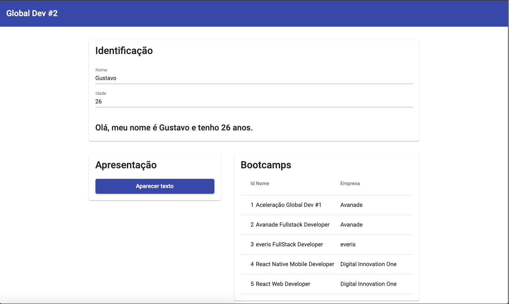

# Desafio Aceleração Global Dev #2

## Objetivo
Esse repositório tem como objetivo mostrar o desafio proposto pelo programa Aceleração Global Dev #2, da Avanade, em parceria com a Digital Innovation One. Os requisitos do projeto são:

- Crie uma aplicação Angular (Não esqueça que todo código precisa estar no GitHub)
- Crie no mínimo 3 componentes que deverão estar interagindo na mesma página (Não esqueça das rotas)
- Escolha no mínimo 4 componentes do Angular Material e incorpore eles em sua aplicação.
- Crie em uma das páginas uma interação através da Interpolação e/ou utilizando Property Biding.
- Crie uma explicação sobre o que foi feito, esta explicação será inserida na plataforma junto com o link para o código no GitHub.
- Você poderá criar um vídeo demonstrativo da aplicação construída, e publicá-lo no YouTube, passando o link de acesso na plataforma. Este passo 6, não é obrigatório, mas entrará como um diferencial. 


## Demonstração

[Clique aqui](https://youtu.be/d9w0v5RNxa4) para assistir à demonstração do desafio.

## Imagens



## Como executar o projeto

- Fazer o clone desse repositório;
- Na pasta do repositório, executar, no terminal, o comando
``` npm install ```;
- Executar o comando ``` ng serve ```;
- Abrir o browser de sua preferência e navegar para ```http://localhost:4200/```.
